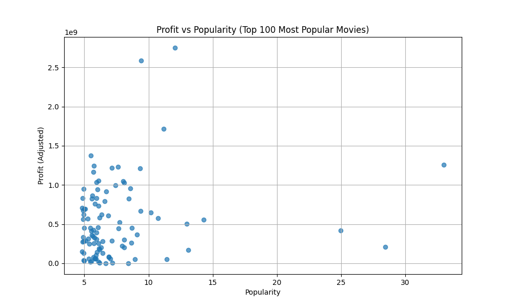
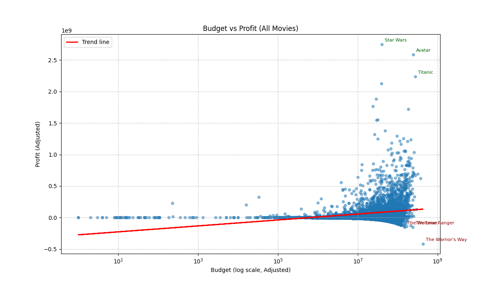

# Tiki API Data to PostgreSQL

[](https://www.python.org/)
[](LICENSE)

---

## Overview

This repository provides a Python-based analysis pipeline (main.py) that performs deep cleaning, data validation, deduplication, and exploratory analysis on the TMDB movie dataset.

It is designed for stability, reproducibility, and reporting, combining 15 analysis scripts into a single sequential workflow.

---

## Features

- 🔄 Downloads TMDB dataset automatically from GitHub
- 🧹 Cleans messy CSVs and fixes ambiguous fields
- ⚠️ Detects unusual characters and suspicious records
- ♻️ Removes duplicates and enforces correct data types
- 📊 Provides statistics, top movie lists, and genre summaries
- 💰 Calculates profits, top P&L, top companies, and revenue stats
- 📈 Visualizations:
    - Popularity vs Profit (Top 100 movies)
    - Budget vs Profit (All movies)

---

## Project Structure

| File                            | Description                                      |
| ------------------------------- | ------------------------------------------------ |
| `main.py`                       | Combined pipeline of all 15 scripts              |
| `tmdb-movies.csv`               | Raw TMDB dataset downloaded from GitHub          |
| `movies-clean.csv`              | Cleaned CSV after removing inconsistencies       |
| `clean-data.csv`                | Deduplicated CSV                                 |
| `release_desc.csv`              | Movies sorted by release date descending         |
| `avg_rate.csv`                  | Movies with high ratings (≥7.5)                  |
| `Min_max.csv`                   | Min and Max revenue movies                       |
| `top10_profit.csv`              | Top 10 movies by profit                          |
| `Dir-Act.csv`                   | Top director and actor                           |
| `genres.csv`                    | Movies by genre                                  |
| `TopP&L.csv`                    | Top profitable and biggest loss movies           |
| `TopCompany.csv`                | Top production companies (count & total profit)  |
| `unusual_characters_report.tsv` | Report on unusual characters per column          |
| `suspicious_records.csv`        | Records with short, numeric, or date-like titles |
| `tmdb_analysis.log`             | Pipeline execution log                           |

---

## Release Date Boundaries

The release_date column is processed with year bounds 1900–2015:
- 1900: Based on the start of modern movie history.
- 2015: The latest movie in the dataset is dated 31/12/2015.
- Ensures the pipeline uses realistic, dataset-relevant boundaries and avoids misinterpreting ambiguous two-digit years.

---

## Installation

Clone the repository:

```bash
git clone https://github.com/ndlryan/TMDB-Movie-Deep-Clean-Analysis.git
cd TMDB-Movie-Deep-Clean-Analysis
```

Install dependencies:
```bash
pip install -r requirements.txt
# Or manually: pandas, matplotlib, numpy
```

---

## Running the Analysis

Run the pipeline:

```bash
python main.py
```

This will:
1. Download the TMDB dataset
2. Generate unusual character report
3. Clean and deduplicate the dataset
4. Detect suspicious records
5. Analyze and sort movies (release date, rating, revenue, profit)
6. Summarize directors, actors, genres, and companies
7. Generate visualizations for popularity vs profit and budget vs profit

All output files will be saved in the project folder.

---

## Visualizations Insisghts

### 1. Popularity vs Profit (Top 100)


- Audience attention doesn’t always translate into box office success.
- 💡 Observation: High popularity does not guarantee high profit — audience attention is not the same as box office success.

### 2. Budget vs Profit (All movies)


- Big investments don’t guarantee big returns — even high-budget films can lose money.

- 💡 Observation: Large budgets do not guarantee large profits — big investment is no guarantee of box office success.
  
---

## Notes

Always ensure a stable internet connection to download the dataset.

CSV outputs are overwritten on each run; backup if needed.

For large-scale analysis, increase your system memory if needed.

---

## Author

**Ryan**  
[GitHub Profile](https://github.com/ndlryan)

A complete, sequential, and fault-tolerant TMDB movie dataset analysis pipeline — combining cleaning, validation, exploration, and visualization.
